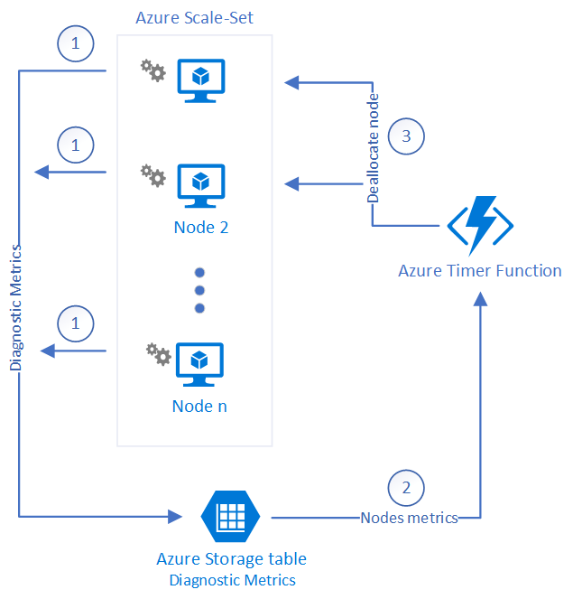

# Smart scaling for Azure Scale Set with Azure Functions

*_Notice_*: _This sample code is provided for conceptual demo purposes only and not intended for direct production use._

Azure Scale Set has a lack of ability to scale down nodes in the right way. Unfortunately, when an auto scale rule is triggered a scale set kills node with the highest node id. In some cases this behaviour is not suitable, for example, when nodes have a state or computing calculation for a long period of time: rendering, hosting game sessions and etc. It's critical in those scenarios because a scale set can kill a wrong node that still busy and doesn’t touch idle nodes. Therefore, this solution can help avoid such situations and help scale down scale set in the right way – killing only idle nodes based on each node metrics.

## How it works

Below you can find the chart of the solution. 

Logic steps of workflow:
1.	Each node in the Azure Scale Set has configured diagnostic extension that sending metrics to Azure Table Storage.
2.	Azure Function is triggered on a time basis, downloads metrics from the corresponded azure table and calculates average numbers for each node and for each metric. 
3.	If there is any node that has metric values below the thresholds, then the function kills a specific node in the scale set.

## What in this repository

1.	**httpTriggerAutoScale** Azure Function C# source code. There are timer and HTTP functions. Currently, the function only monitors two metrics: CPU and Disk, it can be changed in source code.
2.	**metrics_config.json** Azure template for Azure Linux Diagnostic Extension. You can read more details about that format and usage [here](https://docs.microsoft.com/ru-ru/azure/azure-monitor/platform/diagnostics-extension-schema).  
3.	**metrics_config_win.json** Azure template for Azure Windows Diagnostic Extension. You can read more details about that format and usage [here](https://docs.microsoft.com/ru-ru/azure/azure-monitor/platform/diagnostics-extension-schema).  
4.	**scale_set_create.sh** Automation script that deploys and configures all needed azure services. The script has a list of parameters that covered below. 

Here is a list of Azure services and entities to deploy and to fully configure by the script:
1.	Azure Scale Set
2.	Azure Storage Account
3.  Azure Service Principal for the Azure Function with rights for the resources group with the Scale Set 
4.	Azure Function host and deploy azure function

## Deployment instruction

In this repository, you can find an automation bash script “scale_set_create.sh”, it needs to be correctly configured before execution. There is only one param that needs to be changed - **AZURE_SUBSCRIPTION_ID** for others parameters values auto-generated using a random function or have default values. Here is a detailed description of each parameter that can be changed:

### Base parameters

  * **AZURE_SUBSCRIPTION_ID** – Azure Subscription ID.
  * **AZURE_DC_LOCATION** –  default value – “southcentralus”
  * **AZURE_RG_NAME** – Azure Resource Group name, default value autogenerated – smart-scale-set-$AZURE_RANDOM_ID-rg.
  * **AZURE_SCALESET_NAME** – Scale Set name, default value autogenerated – “smart-scale-set-$AZURE_RANDOM_ID”
  * **AZURE_SCALESET_LB** – Scale Set Load Balancer Name, default value autogenerated – smart-scale-set-lb-$AZURE_RANDOM_ID
  * **AZURE_SCALESET_SUBNET** – Optional, you can set network subnetwork resource id where new scale set will be added.
  * **AZURE_SCALESET_BASE_IMAGE** – VM image for scale set, default value is - Win2016Datacenter. For default Linux image use that name – UbuntuLTS
  * **AZURE_SCALESET_VM_SKU**  - VM Size, default value - Standard_B1s
  * **AZURE_SCALESET_VM_USER_NAME** – Optional, VM admin name, default value - scale_set_user
  * **AZURE_SCALESET_VM_USER_PASSWORD**– Optional, VM admin password
  * **AZURE_SCALESET_INSTANCE_COUNT** – Number of nodes in new scale set, default value – 10
  * **AZURE_SA_NAME** - Azure Storage Account name for the metrics collection usage, default value autogenerated - metricsstorage$AZURE_RANDOM_ID
  * **AZURE_FUNC_NAME** - Azure Function host name, default value autogenerated - ScaleSetManager$AZURE_RANDOM_ID
  * **AZURE_FUNC_PACKAGE** - Azure FunctionApp Zip Package Name, default value - ScaleDown.zip. That file should sit in same folder with script. 

### Parameters for Function app logic of scaling

  * **FUNC_PARAM_LOOKUP_TIME_IN_MINUTES** - Lookup metrics window in minutes that function will use to calculate average numbers. Default value - 5
  * **FUNC_PARAM_CPU_TRESHOLD** - CPU threshold in percent. Default value - 5
  * **FUNC_PARAM_STARTUP_DELAY_IN_MIN** - Startup delay for function after it will start monitoring. Default value - 0
  * **FUNC_PARAM_DISK_TRESHOLD_BYTES** – Disk threshold in bytes per second for all disks. corresponded metric name for Linux –“/builtin/disk/bytespersecond” and for Windows – “\PhysicalDisk(_Total)\Disk Read Bytes/sec”  Default value - 3145728
  * **FUNC_PARAM_MIN_NODES_NUMBER** - Minimum number of nodes for cluster. Default value -- 1
  * **FUNC_PARAM_TABLE_PREFIX** – Table metrics prefix. Default value - WADMetricsPT1M

  *_Notice_*: _This sample code is provided for conceptual demo purposes only and not intended for direct production use._